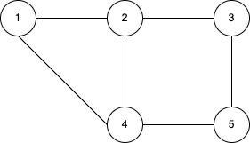
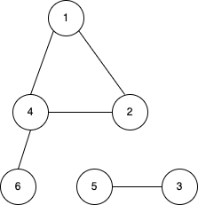
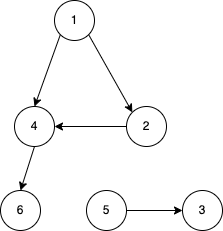
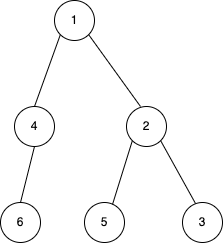
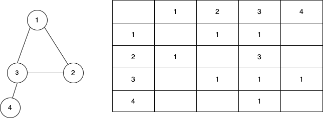
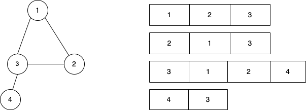

### Graph
----------
* Graph is a non liner data structure consists of nodes and edges. Nodes are connected by edges.  

* All the circle with the numbers are called nodes and the line connecting nodes are called edges.
* Sometimes there would be a node or group of nodes in a graph which can't be accessed from other nodes. We call that single node or group of nodes a conned components. In the below figure we have 2 connected components(`1-2-4-6` and `5-3`). Each node of a connected component can be accessed from other nodes by direct edges of via series of intermediate edges.  

* All the examples showed in the above images are undirected graphs as edges are bidirectional. If two nodes connected by an undirected edge, then we can traverse from first node to the second node and vice versa.
* Image below is a directed graph. The edges of a directed graph have specific direction in which we can traverse between the nodes i.e we can only traverse from 5 to 3 but not from 3 to 5.  

### Tree
----------
* Tree is a kind of graph where there is no cycle formation between the nodes. If a tree has `n` nodes then there would be `n-1` edges.  

* Tree organizes data in hierarchical structure where data are arranged in different levels.
* Here 1 is called `root` node which is the top most node in the hierarchy. 
* If two nodes are connected by an edge then `parent-child` relationship is formed. 4 and 2 are child of 1(parent of 4, 2).
* Nodes which have the same parent are called `siblings`. 5 and 3 are siblings as they have 2 as common parent.
* A `leaf` node  doesn't have any child node. Here we have three leaf nodes i.e 6, 5 and 3.
* `Depth` of a node is the number of edges from the node to the root node.
* `Height` of a node is the number of edges of on the longest path from the node to a leaf.
### Graph & Tree Representation in code
---------
* Graph and trees can be represented using adjacency matrix and adjacency list. 
#### Adjacency Matrix
* In this method we construct `n x n` matrix `a` where `n` is the number of nods(vertices). We would assign `a[i][j]=1`(where `i,j < n`) if `i` and `j` nodes are connected else `a[i][j]=0`.  
  
* Let's say we are given number of nodes as `n`, number of edges `e`. Also we are given connected nodes for each edge in next `e` lines.  
```
input:
4 4
1 2
1 3
2 3
3 4
```
```cpp
// global declaration if matrix is of bigger size
const int N = 1e5+10;
vector<vector<int>> matrix (N, vector<int>(N, 0));

int main(){
    int n, e;
    cin >> n >> e;
    // local declaration with each cell zero
    vector<vector<int>> matrix (n+1, vector<int>(n+1, 0));
    for(int i = 1; i <= e; ++i){
        int v1, v2;
        cin >> v1 >> v2;
        matrix[v1][v2] = 1;
        matrix[v2][v1] = 1; // this required for undirected graphs(remove this line for directed graph)
    }
    cout << matrix[3][4] << matrix[1][4] << endl;
}
```
* We have to create 5 x 5 matrix for 4 nodes as vectors start with 0 index.
* As above example is an undirected graph, so if 1 is connected to 2 it also implies that 2 is connected to 1.
* If we have a weighted graph then we should keep the weight of the edge in the cell instead of 1.
* The biggest disadvantage of this approach is the space complexity would be O(N^2).
* Finding if a node is connected to another node has time complexity of O(1).
#### Adjacency List
* In this approach each node(vertices) would have it's own array which would contain all the other nodes connected to that node.  
  
* Let's say we are given number of nodes as `n`, number of edges `e`. Also we are given connected nodes for each edge in next `e` lines.  
```
input:
4 4
1 2
1 3
2 3
3 4
```
```cpp
int main(){
    int n, e;
    cin >> n >> e;
    vector<int> matrix[n+1];
    for(int i = 1; i <= e; i++){
        int v1, v2;
        cin >> v1 >> v2;
        matrix[v1].push_back(v2);
        matrix[v2].push_back(v1);
    }
    for(int i = 0; i<=n; ++i){
        cout << i << "->";
        for(int j = 0; j<matrix[i].size(); ++j){
            cout << matrix[i][j] << " ";
        }
        cout << endl;
    }
}
```
```
output:
0->
1->2 3 
2->1 3 
3->1 2 4 
4->3
```
* In this approach the space complexity would be O(n+e) but finding if a node is connected to another node would be of O(n).
* In we have weight associated with the edges, we can use vector of pairs instead of vector of int.