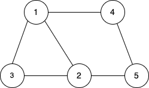
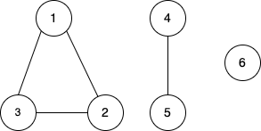
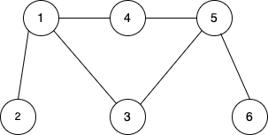

### Depth First Search(DFS)
-------------------------
* In DFS we start from a parent node then traverse all the children of that node one by one. We don't go to the next node until all the child of the current node is traversed.  

```
input:
5 6
1 2
1 3
1 4
2 3
2 5
4 5
```
```cpp
// global declaration
const int N = 1e5+10;
vector<int> graph[N];
map<int, bool> isVisited;

void dfs(int node){
    isVisited[node] = true;
    for(int child: graph[node]){
        cout << "* " << "parent: " << node << " child: " << child << endl;
        if(isVisited[child]){
            continue;
        }
        dfs(child);
    }
}

int main(){
    int n, e;
    cin >> n >> e;
    for(int i = 1; i <= e; i++){
        int v1, v2;
        cin >> v1 >> v2;
        graph[v1].push_back(v2);
        graph[v2].push_back(v1);
    }
    for(int i = 1; i <= n; ++i){
        if(isVisited[i]){
            continue;
        }
        dfs(i);
    }
}
```
```
output:
* parent: 1 child: 2 [mark 1 as visited and move to 2 (1 parent start)]
* parent: 2 child: 1 [backtrack to 2 as 1 is visited (2 parent start)]
* parent: 2 child: 3 [move to 3 from 2 and mark 3 as visited (3 parent start)]
* parent: 3 child: 1 [back track to 3 as 1 is visited]
* parent: 3 child: 2 [back track to 3 as 2 is visited (3 parent end as at this point all the nodes of 3 are visited)]
* parent: 2 child: 5 [for parent 2 move to the next node 5(mark visited) as 1 and 3 are visited(5 parent start)]
* parent: 5 child: 2 [back track to 5 as 2 is visited]
* parent: 5 child: 4 [move to 4 from 5 and mark 4 as visited (4 parent start)]
* parent: 4 child: 1 [back track to 4 as 1 is visited]
* parent: 4 child: 5 [back track to 4 as 5 is visited(4 parent end - 1, 5 visited)(5 parent end - 2, 4 visited)(2 parent end- 1, 3 & 5 visited)]
* parent: 1 child: 3 [back track to 1 as 3 is visited]
* parent: 1 child: 4 [back track to 1 as 4 is visited(1 parent end - 3, 4 is visited)]
```
**Question 1:-** For a given undirected graph, find the total number of connected components. First line of input contains number of nodes(n) and edges(e) respectively. Next e number of lines contains edges of the graph.
```
input:
6 4 // 6(nodes), 4(edges)
1 2
1 3
3 2
4 5
```  
  
**Ans :-** 
* To solve this we can try to apply DFS on all the nodes one by one. If we apply DFS on any node of a connected component it will  visit all the nodes of that connected component i.e if we apply DFS on 1 it will visit 2 and 3. 
* Now if we try to apply DFS on 2 and 3 next time, it will not be applied as it would be visited already. So we will only be able to apply DFS to separate connected component such as 4-5 and 6. We will count number of times DFS gets applied and it would be the same as number of connected components.
```cpp
const int N = 1e5+10;
vector<int> graph[N];
bool isVisited[N];

void dfs(int node){
    isVisited[node] = true;
    for(int child: graph[node]){
        if(isVisited[child]){
            continue;
        }
        dfs(child);
    }
}

int main(){
    int n, e;
    cin >> n >> e;
    for(int i = 1; i <= e; ++i){
        int v1, v2;
        cin >> v1 >> v2;
        graph[v1].push_back(v2);
        graph[v2].push_back(v1);
    }
    int count = 0;
    for(int i = 1; i <= n; ++i){
        if(!isVisited[i]){
            count++;
            dfs(i);
        }
    }
    cout << count << endl;
}
```
```
output:
3
```
**Question 2:-** For a given undirected graph, find if there is a cycle exists in the given graph. First line of input contains number of nodes(n) and edges(e) respectively. Next e number of lines contains edges of the graph.
```
input:
6 6 // 6(nodes), 6(edges)
1 2
1 3
1 4
4 3
4 5
```  
  
**Ans :-** 
* Let's say in the above image we traverse from 1 to 4, 4 to 5 then 5 to 3. We have to check if any of the children of 3 apart from 5 is already visited.
* For node 3, 1 is one of the children which is already visited so we can clearly assume that there are intermediate edges and nodes which connects from 1 to 3 indirectly and now we have an edge which connected directly 3 to 1 so there is a cycle exists.
```cpp
```